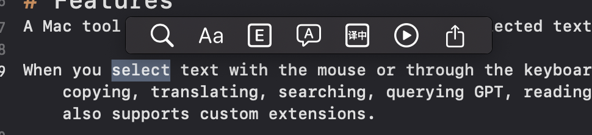
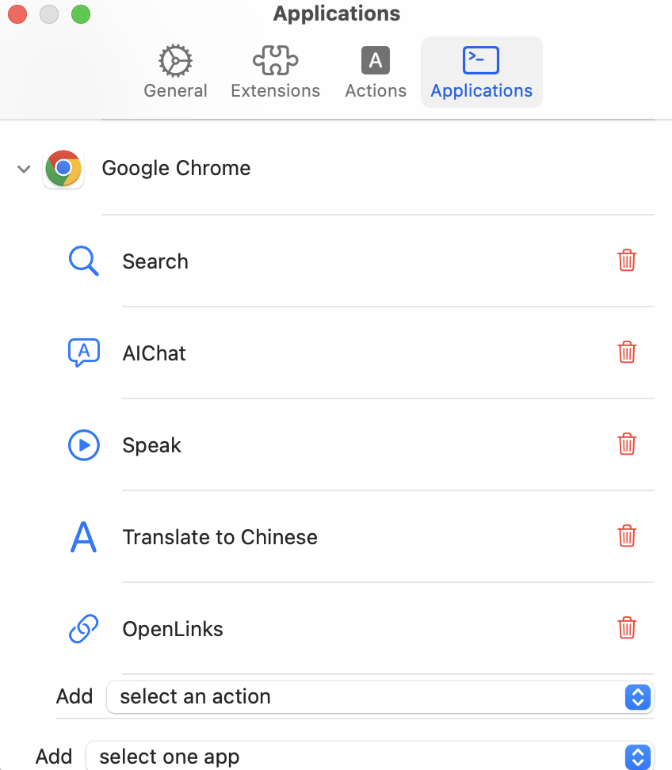

# Function
A Mac tool that allows various operations on selected text.

When you select text with the mouse or through the keyboard (cmd+A, cmd+shift+arrow keys), the Selected toolbar will automatically pop up, allowing quick text operations such as copying, translating, searching, querying GPT, reading text aloud, opening links, keyboard operations, executing commands, etc. It also supports custom extensions.



1. Allows for the customization of operation lists for different applications. (This can be configured in "Settings - Applications")

2. Supports customizing the addresses and keys for OpenAI and Gemini API. The translation and inquiry GPT functions depend on this.
3. Supports custom extensions.

# Custom Action List

This can be configured in "Settings - Applications".



1. Supports adding currently running applications (does not support deleting an application)
   * Add through "Add - Select an Application"
2. Supports setting a series of actions for an application
  - Add through "Add - Select an Action"
  - Supports deleting an action
  - Supports drag-and-drop to rearrange the order of actions

## Built-in Operations

| Action          | action.identifier | function                                                 | icon |
| -------------------- | ------------------------ | ------------------------------------------------------------ | ---- |
| Web Search           | selected.websearch       | Search via https://www.google.com/search. It can be customized in the settings page. | 🔍    |
| OpenLinks            | selected.openlinks       | Open all URL links in the text at the same time. | 🔗    |
| Copy                 | selected.copy            | Copy the currently selected text.            | 📃    |
| Speak                | selected.speak           | Read the text. If an OpenAI API Key is configured, use OpenAI's TTS (Text-to-Speech) service to generate speech, otherwise use the system's text reading functionality. | ▶️    |
| 翻译到中文           | selected.translation.cn  | Translate to Chinese. If the selected text is a word, translate the detailed meaning of the word. An API key must be configured in the settings. | 译中 |
| Translate to English | selected.translation.en  | Translate to English. You need to configure the OpenAI or Gemini API key in the settings. | 🌍    |

## Custom Extentions

The extension is placed in the `Library/Application Support/Selected/Extensions` directory, with one directory per extension.

Inside the extension directory, there must be a `config.yaml` file that describes the relevant information about the extension.

Example：

```yam
info:
  icon: file://./go-logo-white.svg
  name: Go Search
  enabled: true
actions:
- meta:
    title: GoSearch
    icon: file://./go-logo-white.svg
    identifier: selected.gosearch
    after: ""
  url:
    url: https://pkg.go.dev/search?limit=25&m=symbol&q={text}
```

| Fields                | Type | Description                                  |
| -------------------------- | ------ | ------------------------------------------------------------ |
| info                       | object | Base information of the extension.         |
| info.icon                  | string | Icon. The icon size should be 30*30. It supports specifying files with `file://`. `file://./go-logo-white.svg` is an example of loading the icon from the extension directory. It also supports direct configuration of sf symbols, such as `magnifyingglass` (🔍). The icon will be displayed in the configured extension list. |
| info.name                  | string | Extension name                |
| enabled                    | boolean | Whether activate this extension or not. |
| actions                    | list | Action List                                |
| action.meta                | object | Meta information of the Action                    |
| action.meta.title          | string | Action title. Used to display the name of the operation when the mouse hovers over the toolbar. |
| action.meta.icon           | string | The setup is the same as info.icon. It is used for display on the toolbar. |
| action.meta.identifier     | string  | action's id, unique identifier       |
| action.meta.after     | string | Handling after the action is executed. Required. Supports configuration of empty (`""`), `paste`, `copy`, `show`. |
| action.meta.regex | string | Regular expressions, used to match selected text, only display action when a match occurs. Optional values. |
| action.url                 | object | Action of URL type |
| action.url.url             | string | A link that, upon clicking (action), will open this link. It supports schemes to open other apps. For example, `https://www.google.com.hk/search?q={selected.text} `for conducting a Google search. Or open `things:///add?title={selected.text}&show-quick-entry=true` to add a task in Things3. `{selected.text}` is used to replace the selected text. |
| action.service             | object | Action of service type                   |
| action.service.name | string | Service Name。For example, `Make Sticky` creates a new note (note application). |
| action.keycombo            | object | Shortcut key type action |
| action.keycombo.keycombo   | string | Shortcut keys, such as "cmd i", etc. Support for function keys like "cmd", "shift", "ctrl", "option", "fn", "caps", as well as lowercase letters, numbers, symbols, and other key positions. Key positioning support is not yet complete, pending further testing and improvement. |
| action.gpt                 | object | To interact with GPT, such as OpenAI (3.5 turbo model) or Gemini, you need to configure the relevant API key in the settings. |
| action.gpt.prompt          | string | GPT prompt words, such as `enriching and refining the following content. The content reads: {selected.text}.` Use `{selected.text}` to replace the selected text. |
| action.runCommand | object | Execute a command |
| action.runCommand.command | string | Command and parameter list. The working directory during command execution is the plugin directory. The environment variables currently provided include: `SELECTED_TEXT` and `SELECTED_BUNDLEID`, which represent the currently selected text and the current application, respectively. |

Each action can and must be configured with only one of the following: action.url, action.service, action.keycombo, action.gpt, or action.runCommand.

# Note
This tool is a hobby project of the author and is still under rapid development and iteration, with incomplete features. Everyone is welcome to submit suggestions for features and implementation code.

# Contribution
This project welcomes any contributions.

As the author is a complete beginner in Swift, SwiftUI, and macOS App development, all implementations are acquired through GPT, searching, and reading the code and documentation of related projects (EasyDict, PopClip). Therefore, if you wish to contribute code, please clearly explain how the code is implemented and why it is implemented in this way, to help the author understand your code.
