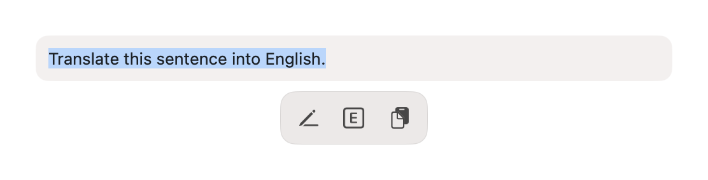
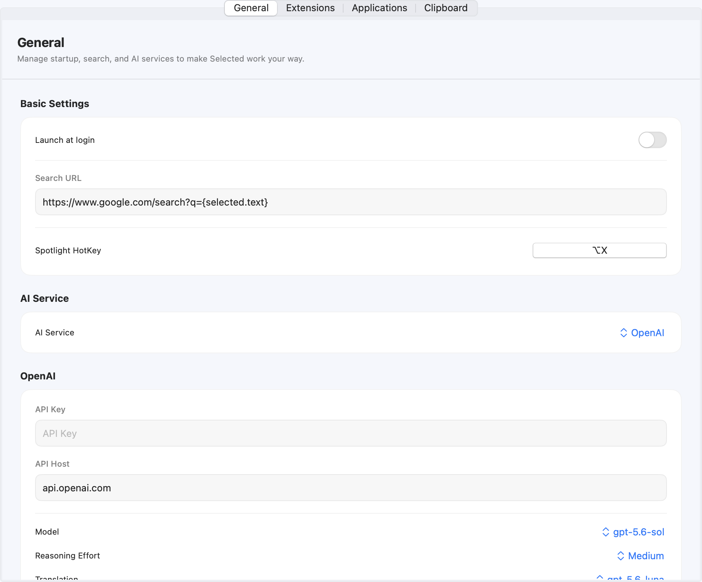
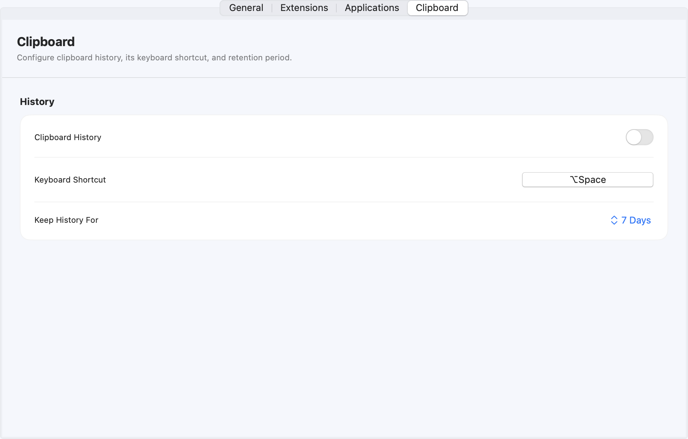
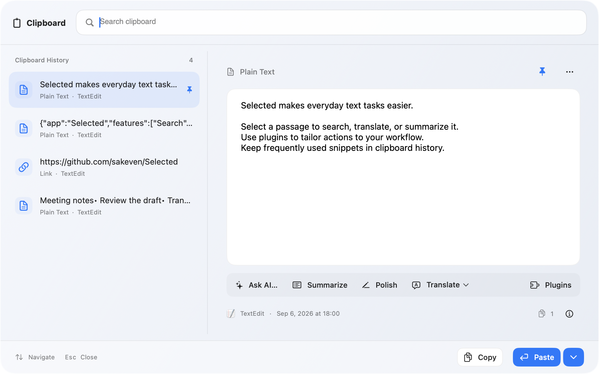
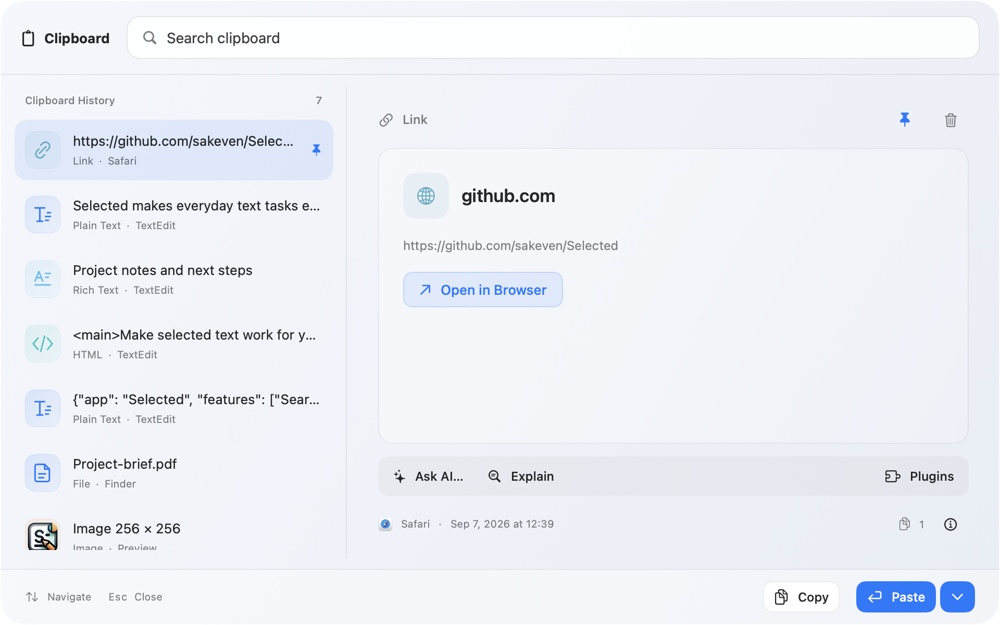
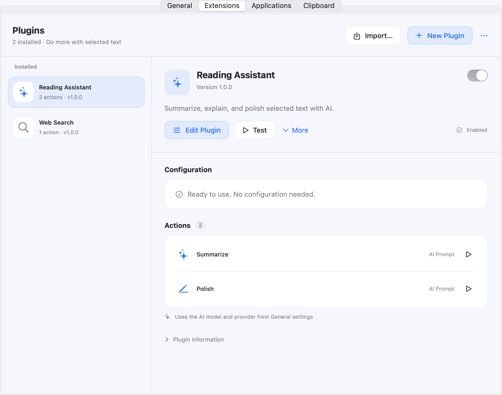
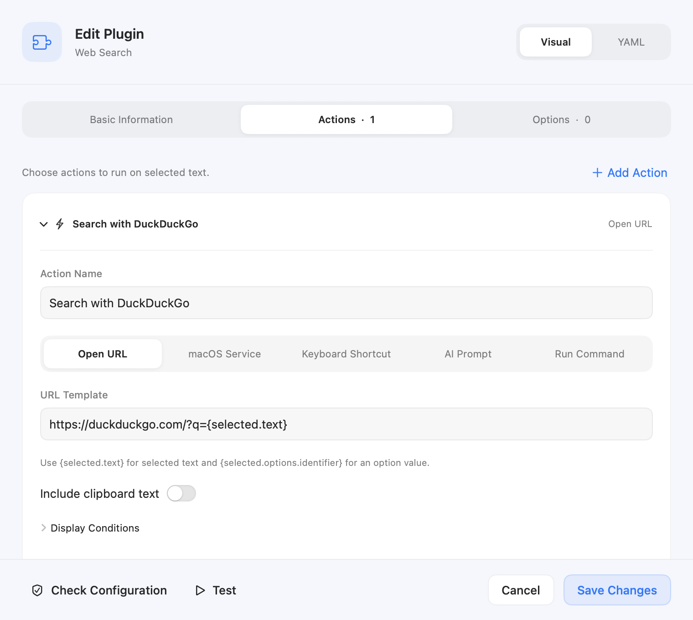
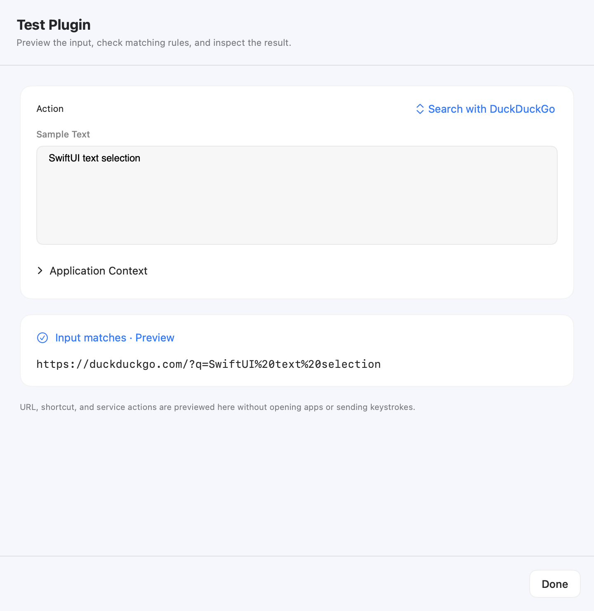

# Selected

A macOS menu bar app for working with selected text. Select a passage to search, translate, copy, read aloud, or run a custom action. Use the quick input panel when there is nothing to select, and clipboard history to find and reuse copied content.

Selected supports English and Simplified Chinese interfaces. This guide describes the current 0.2.6 source version; older releases may have different screens or features.


## Contents

- [Installation and first launch](#installation-and-first-launch)
- [Browser setup](#browser-setup)
- [Features](#features)
- [AI configuration and chat](#ai-configuration-and-chat)
- [Application-specific actions](#application-specific-actions)
- [Clipboard history](#clipboard-history)
- [Custom extensions](#custom-extensions)
- [Troubleshooting](#troubleshooting)
- [Contributing](#contributing)

## Installation and first launch

**Requirements: macOS 15.0 or later.**

1. Download `Selected.zip` from [Releases](https://github.com/sakeven/Selected/releases).
2. Unzip it and move `Selected.app` to **Applications**.
3. Open Selected. In **System Settings → Privacy & Security → Accessibility**, enable Selected so it can read selected text and perform text actions.
4. Click the Selected icon in the menu bar and choose **Settings**. Selected runs in the menu bar and does not show a Dock icon or a main window.
5. Select text in another app and click an action on the toolbar. Search and copy work without an AI key. To use translation or AI actions, complete [AI configuration](#ai-configuration-and-chat).

In **Settings → General**, you can enable **Launch at login**, change the **Search URL**, and record a **Spotlight HotKey**. Use **Pause** / **Resume** in the menu bar menu to temporarily stop or restart the selection toolbar. **Check for Updates…** is available in the same menu.

## Browser setup

Selected uses browser automation to read selected webpage text and its source URL. Allow Selected to control your browser when macOS requests Automation access; existing permissions are listed under **System Settings → Privacy & Security → Automation**.

| Browser | Setup |
| --- | --- |
| Safari | In **Safari → Settings → Advanced**, enable **Show features for web developers**. Then open the **Developer** settings pane and enable **Allow JavaScript from Apple Events**. See Apple's [developer tools setup](https://support.apple.com/en-gb/guide/safari/sfri20948/mac) and [Developer settings](https://developer.apple.com/documentation/safari-developer-tools/developer-settings). |
| Google Chrome | Choose **View → Developer → Allow JavaScript from Apple Events** in the menu bar. See the [Chromium instructions](https://www.chromium.org/developers/applescript/). |

Selected also includes integration for Microsoft Edge and Arc. Available text depends on what the app or webpage exposes; some editors use a copy-based fallback. See the community [Supported Applications list](https://github.com/sakeven/Selected/wiki/Supported-Applications) for compatibility reports.

## Features

### Selection toolbar

Drag to select text, double-click a word, or use **⌘A** / **⌘⇧Arrow** in another app. Selected displays the matching actions near the selection. Hover over an icon for about 600 ms to see its action name. The available actions depend on your application configuration, enabled plugins, and the selected content.

| Action | What it does |
| --- | --- |
| Search | Searches with the URL configured in General settings. Include `{selected.text}` where the search query belongs, for example `https://www.google.com/search?q={selected.text}`. |
| Translate to Chinese / English | Translates with the selected AI provider. Translating a word to Chinese includes definitions and examples. |
| Copy | Copies the selected text. |
| Speak | Reads the text with the system voice when no OpenAI key is configured. With an OpenAI key, it uses the OpenAI voice and TTS model selected in General settings. |
| Open Links | Opens links detected in the selected text. Appears when links are detected. |
| Map | Opens a detected address in Maps. Appears when an address is detected. |
| Share | Opens the macOS sharing menu for the selected text. |
| Calculator | Displays the result of a selected expression such as `1+2/3*4-5`. Click the result to copy it. |

### Quick input

Press **⌥X** to open Selected's **Spotlight** input panel. Type or paste text, then choose an action below the field. This provides the text actions without first selecting something in another app. Change the shortcut in **Settings → General → Spotlight HotKey**.



## AI configuration and chat

Open **Settings → General** and choose **OpenAI** or **Claude** as the **AI Service**. Enter the key for that provider and select a model.

| Setting | How to configure it |
| --- | --- |
| OpenAI API Host | The default is `api.openai.com`. Enter a host name, without `https://` or `/v1`. Custom hosts must support the API used by the selected model. |
| OpenAI Model | Choose a listed model, or select **Custom** and enter a model identifier supported by your provider. |
| Reasoning Effort | Shown for recognized reasoning models. The available levels depend on the model. |
| Translation | Selects the OpenAI model used for built-in translation. |
| Voice / TTS Model | Controls OpenAI speech output. **TTS Instructions** is available for the supported instruction-based TTS model. Speech uses the OpenAI configuration even when Claude is selected for chat. |
| Claude API Host | The default is `https://api.anthropic.com`. This field takes a base URL including the scheme. |
| Claude Model | Selects the Claude chat model. Built-in Claude translation uses a separate model chosen by the app. |



To start a conversation, create or install an **AI Prompt** plugin with **Open Chat** output handling, then invoke it from the toolbar. You can also open **AI → Ask AI** from a supported clipboard item. Built-in translation opens a translation result; plugin actions use their own output settings.

In the chat window, expand the source context to inspect the input, ask follow-up questions, or add photos and files. Attachment support depends on the provider and file type. Use **⌘Return** to send and **Return** for a new line. You can stop a response, pin the window, or collapse it into a small floating button.


AI requests send the chosen text and attachments to your configured provider. AI plugins can also use their configured tools; review the plugin's actions before running it.

## Application-specific actions

Open **Settings → Applications** to choose which actions appear in each app and in what order.

1. Expand **Default Actions** to configure the list used for apps without their own entry.
2. Click **Add App** to choose an installed or running application.
3. Expand an app and click **Add Action** to add built-in or plugin actions.
4. Drag actions to reorder them, or open the **…** menu on an action for **Move Up**, **Move Down**, and **Delete Action**. The menu is also accessible from the keyboard.
5. Choose **Remove App Configuration** to delete an app-specific entry and return that app to the default configuration.

Changes are saved automatically. An empty action list shows all available matching actions. Actions that replace text are hidden when the selection is not editable; link and map actions also depend on the selected content.


## Clipboard history

Clipboard history is **off by default**. Open **Settings → Clipboard**, enable **Clipboard History**, and choose a retention period. The default shortcut is **⌥Space** and the default retention period is **7 Days**; both can be changed here.



After enabling history, copy content normally, then press **⌥Space** to open it:

- Search saved content and select an item to preview its text, link, image, or file. Use the arrow keys to navigate the list.
- For links, choose **Open in Browser** in the preview to open the address in your default browser.
- Use **Copy** to restore an item to the clipboard, or **Paste** to insert it into the original app. Open the arrow next to **Paste** for **Paste plain text**, which removes formatting when text is available.
- Pin frequently used items with the pin button above the preview. Pinned items are kept when older history is cleaned up.
- Use **Prettify JSON** when the selected text is valid JSON.
- Use the toolbar below the preview for AI actions and **Plugins**. Available AI actions include summarizing, explaining, polishing, extracting text, and translating, depending on the content.
- Use the trash button above the preview to delete an item, or right-click an item for the full action menu. The information button beside the item's source and date shows its full metadata.
- Press **Esc** to dismiss the panel.





## Custom extensions

Open **Settings → Extensions** to install, create, configure, test, and edit plugins. Browse examples in [Selected Extensions](https://github.com/sakeven/Selected-Extensions).

### Install and configure

1. Download and unzip a plugin if needed. A Selected plugin is a `.selectedext` folder containing `config.yaml` and optional icons or scripts.
2. Click **Import…** and choose the `.selectedext` package, or open it with Selected from Finder.
3. Select the plugin, enable it, and fill in its required **Configuration** fields. A plugin marked **Needs Configuration** will not appear in the available actions until those fields are complete.
4. Add its actions in **Settings → Applications** if you use a restricted action list.

The plugin's **More** menu offers export, **Show in Finder**, **Restore Previous Version**, and deletion. The management menu at the top offers **Reload** and **Open Plugins Folder**.



### Create and edit

Click **New Plugin**, or select a plugin and click **Edit Plugin**. The visual editor has **Basic Information**, **Actions**, and **Options** sections, plus a **YAML** mode for advanced editing.

| Action type | Example |
| --- | --- |
| Open URL | Search a website with `https://duckduckgo.com/?q={selected.text}`. Text substitutions are URL-encoded. |
| macOS Service | Send selected text to a named macOS service. |
| Keyboard Shortcut | Send a shortcut such as `cmd shift c`. |
| AI Prompt | Summarize or rewrite text with a prompt such as `Summarize the following: {{selected.text}}`. Uses the provider configured in General settings. |
| Run Command | Run a local command or a script included in the package. Selected text is available as `SELECTED_TEXT`. |

AI and command actions offer output handling such as **Copy to Clipboard**, **Replace Selected Text**, **Show Result**, and **Show and Allow Replacement**. **Open Chat** is available for AI prompts; command actions can ignore output. The **Options** section defines configurable text fields, choices, toggles, and secrets, whose values are entered on the plugin details page.



For a minimal example, create a folder named `WebSearch.selectedext` with this `config.yaml`, then import the folder:

```yaml
schemaVersion: 1
info:
  identifier: com.example.web-search
  name: Web Search
  version: 1.0.0
  icon: symbol:magnifyingglass
actions:
  - meta:
      title: Search with DuckDuckGo
      identifier: com.example.web-search.search
      icon: symbol:magnifyingglass
    url:
      url: https://duckduckgo.com/?q={selected.text}
```

Keep plugin and action identifiers stable. Updating an installed plugin requires a higher version; the editor proposes the next patch version. Selected keeps the previous complete package for restoration and stores user option values separately. Secret plugin options are stored in Keychain. Switching back from YAML validates the definition; saving reformats YAML and removes comments.

### Test a plugin

Click **Test** on the plugin details page or in the editor. Choose an action, enter **Sample Text**, and optionally set an application identifier, webpage URL, and whether the text is editable. The preview shows the prepared input or explains why the action does not match.

URL, shortcut, and service actions are previewed without opening apps or sending keystrokes. **Run AI** sends the sample to your configured provider; **Run Command** executes locally. Test results stay in the test window instead of being copied or pasted. For actions that include clipboard text, enter **Sample Clipboard Text**; testing does not read the system clipboard.



### Import from PopClip

Click **Import…** and choose a `.popclipext` package or `.popclipextz` archive. Review the compatibility report, then click **Import into Selected** when the package is supported.

The current importer supports declarative URL actions, keyboard shortcuts, and plain-text macOS services. It does not provide full PopClip compatibility: unsupported script runtimes and capabilities are reported before import. The original source is retained with the converted plugin. After importing, complete its options and test its actions.

Plugins are installed in `~/Library/Application Support/Selected/Extensions`. Application action lists are saved in `~/Library/Application Support/Selected/UserConfiguration.json`.

## Troubleshooting

| Symptom | What to check |
| --- | --- |
| No main window appears after launch | Selected is a menu bar app. Open Settings from its menu bar icon. |
| The toolbar does not appear | Check Accessibility permission, make sure Selected is not paused, and select text in another app. Try the quick input panel to confirm actions are available. |
| Selection works in an editor but not a browser | Check the browser's Apple Events setting and Selected's Automation permission. |
| Translation or AI produces no result | Check the selected provider, its key, host format, model access, and network connection. OpenAI and Claude use different host formats. |
| A plugin action is missing | Check that the plugin is enabled, required options are filled, its minimum Selected version is met, and the action is included in the app's list. Matching rules and editable-text requirements can also hide actions. |
| A plugin fails to load | Expand the load errors at the bottom of Extensions and use **Repair…** to inspect and fix its YAML. Check for duplicate identifiers and unsupported configuration. |
| Clipboard history is empty or its shortcut does nothing | Enable Clipboard History first, then copy an item. Check whether another app is using the same shortcut. |
| An update to a plugin is rejected | Keep its stable identifier and raise its version above the installed version. |

Screenshots in this guide are rendered from the current SwiftUI views using preview data. Plugin names, clipboard items, and AI responses are examples; no personal history or API credentials are included.

## Contributing

Selected is a hobby project under active development. [Bug reports and feature suggestions](https://github.com/sakeven/Selected/issues), documentation improvements, and pull requests are welcome. For code contributions, explain the implementation and why you chose it so other contributors can follow the change.

To build from source, open `Selected.xcodeproj` in Xcode, let Swift Package Manager resolve dependencies, select the **Selected** scheme and **My Mac**, and run the app. Configure signing for your local environment if needed.

Selected is licensed under [GPL-3.0](LICENSE).
