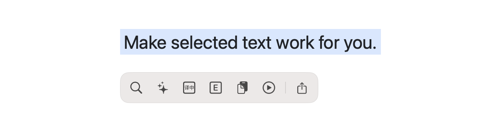
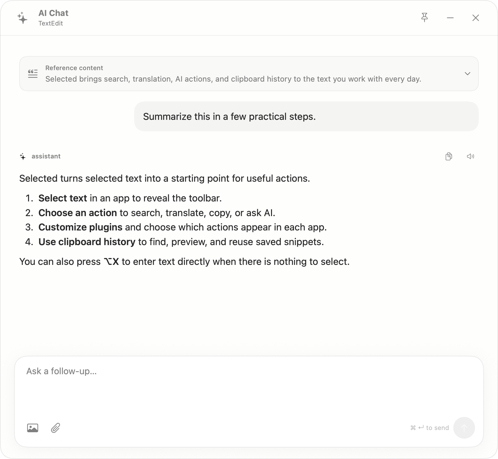
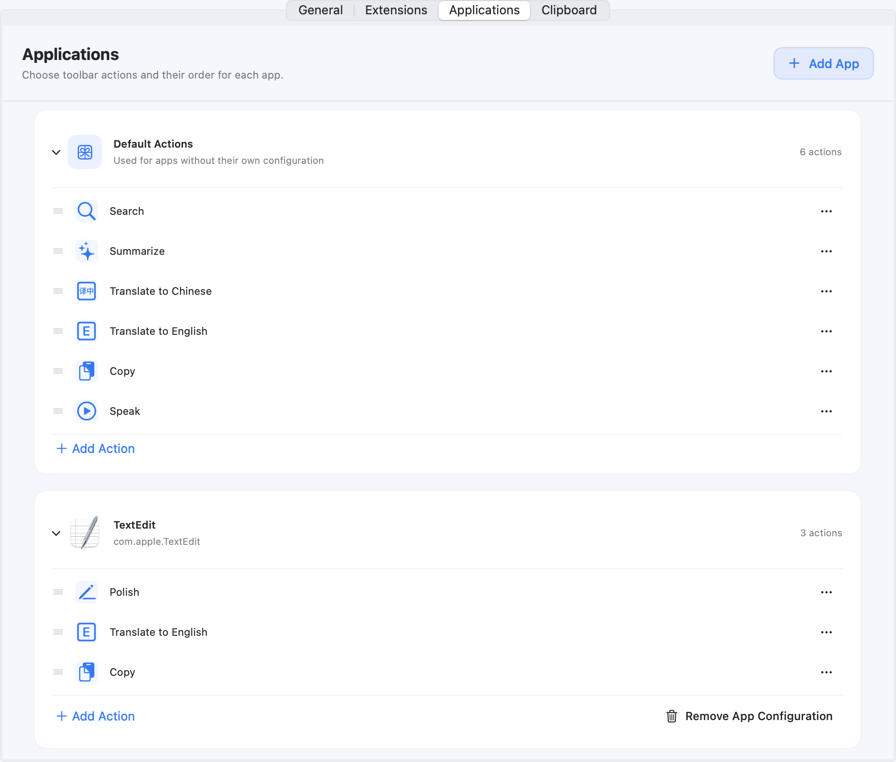

# OS Requirements
macOS Ventura 13.0 or above

# Installation

1. Download Selected.zip from [releases](https://github.com/sakeven/Selected/releases).
2. Unzip it, and move it to the Applications directory.
3. For the first installation, you need to set up Accessibility features to allow this app to capture selected text.

# Settings for web browers
1. Safari: you must enable 'Allow JavaScript from Apple Events' in the Developer section of Safari Settings to use 'do JavaScript'. https://developer.apple.com/documentation/safari-developer-tools/enabling-developer-features

2. Chrome: you need to click on the menu bar: View - Developer - Allow JavaScript from Apple Events.

# Features
A Mac tool that allows various operations on selected text.

When you select text with the mouse or through the keyboard (cmd+A, cmd+shift+arrow keys), the Selected toolbar will automatically pop up, allowing quick text operations such as copying, translating, searching, querying GPT, reading text aloud, opening links, keyboard operations, executing commands, calculating expression or sharing the text, etc. It also supports custom extensions.

1. Allows for the customization of operation lists for different applications. (This can be configured in "Settings - Applications")
2. Supports customizing the addresses and keys for OpenAI, Gemini and Claude API. The translation and inquiry GPT functions depend on this. It also supports OpenAI and Claude's function calling. You can have GPT perform searches, fetch web content, write emails, or control your macOS, and virtually anything else.
3. Supports custom extensions.

# Supported Applications

Some applications have already been tested, while others that have not been tested may also be supported.

See https://github.com/sakeven/Selected/wiki/Supported-Applications

# Custom Action List

This can be configured in "Settings - Applications".

1. Supports adding currently running applications (does not support deleting an application)
    * Add through "Add - Select an Application"
2. Supports setting a series of actions for an application
    - Add through "Add - Select an Action"
    - Supports deleting an action
    - Supports drag-and-drop to rearrange the order of actions

## Built-in Operations

| Action          | action.identifier | function                                                 | icon |
| -------------------- | ------------------------ | ------------------------------------------------------------ | ---- |
| Web Search           | selected.websearch       | Search via https://www.google.com/search. It can be customized in the settings page. | 🔍    |
| OpenLinks            | selected.openlinks       | Open all URL links in the text at the same time. | 🔗    |
| Copy                 | selected.copy            | Copy the currently selected text.            | 📃    |
| Speak                | selected.speak           | Read the text. If an OpenAI API Key is configured, use OpenAI's TTS (Text-to-Speech) service to generate speech, otherwise use the system's text reading functionality. | ▶️    |
| 翻译到中文           | selected.translation.cn  | Translate to Chinese. If the selected text is a word, translate the detailed meaning of the word. An API key must be configured in the settings. | 译中 |
| Translate to English | selected.translation.en  | Translate to English. You need to configure the OpenAI or Gemini API key in the settings. | 🌍    |
| Share | (none) | Share the selected text by macOS share extension. | 📤 |
| Calculator | (none) | Auto calculate the expression like 1+2/3*4-5 when you selected it. | (none) |

## Custom Extensions

Open **Settings → Extensions** to create, import, configure, and visually edit plugins. The editor supports URL, macOS Service, keyboard shortcut, AI prompt, and command actions, with a YAML view for advanced configuration.

Plugins are `.selectedext` folders containing `config.yaml` and optional icons/scripts, installed in `~/Library/Application Support/Selected/Extensions`. Updates match a stable plugin identifier and require a higher version. The previous complete package can be restored from Settings; user parameters and Keychain secrets are stored separately.

See [Plugin system and configuration reference](PluginSystem.md) for the schema, version rules, action semantics, options, examples, and the comparison with PopClip.

# Official Extensions

See https://github.com/sakeven/Selected-Extensions

# Note
This tool is a hobby project of the author and is still under rapid development and iteration, with incomplete features. Everyone is welcome to submit suggestions for features and implementation code.

# Contribution
This project welcomes any contributions.

As the author is a complete beginner in Swift, SwiftUI, and macOS App development, all implementations are acquired through GPT, searching, and reading the code and documentation of related projects (EasyDict, PopClip). Therefore, if you wish to contribute code, please clearly explain how the code is implemented and why it is implemented in this way, to help the author understand your code.
