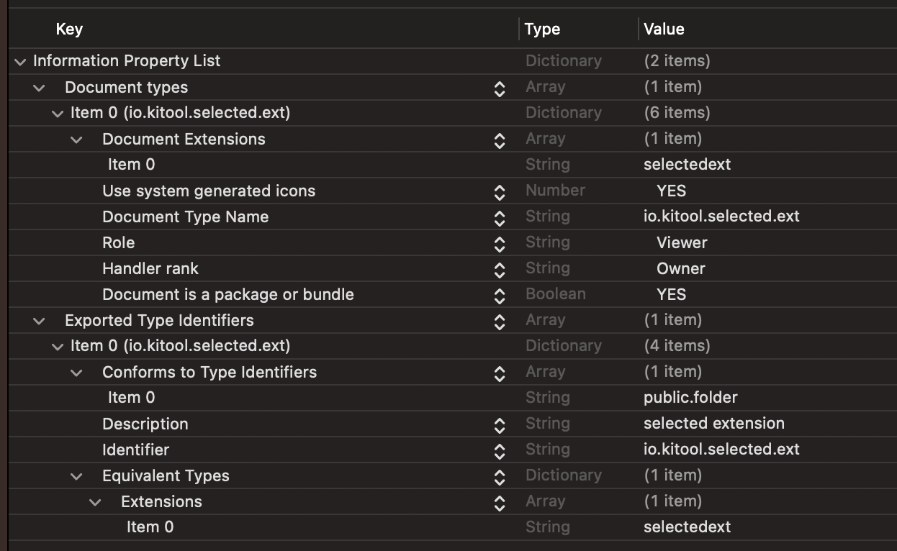

如果是自定义的扩展名，首先需要为该扩展名创建一个唯一的 Uniform Type Identifier（UTI），然后注册到系统中。然后，可以使用同样的方法来设置默认应用程序。这通常需要在应用程序的 Info.plist 文件中添加相关的键值对来声明自定义文件类型（UTI）。

以下是基于自定义扩展名进行操作的步骤：



**步骤 1：在 Info.plist 中定义自定义扩展名**

1. 打开应用程序的 Info.plist 文件。
2. 增加一个新的 CFBundleDocumentTypes 键（如果尚不存在）
3. 在 CFBundleDocumentTypes 下面，添加一个新的字典，为自定义扩展名定义 CFBundleTypeName 和 CFBundleTypeExtensions。
4. 如果需要将一个目录注册为包，则需要配置 LSTypeIsPackage 为 true。


```plist
<key>CFBundleDocumentTypes</key>
<array>
  <dict>
    <key>CFBundleTypeExtensions</key>
    <array>
      <string>自定义扩展名，不包含.</string>
    </array>
    <key>CFBundleTypeIconFile</key>
    <string>IconFileName</string>
    <key>CFBundleTypeName</key>
    <string>自定义文件类型名称</string>
    <key>CFBundleTypeRole</key>
    <string>Editor</string>
    <key>LSHandlerRank</key>
    <string>Owner</string>
    <key>LSItemContentTypes</key>
    <array>
      <string>自定义UTI</string>
    </array>
  </dict>
</array>
```


这里有一个问题，我一配置 LSItemContentTypes，就没法使用，去掉就能正常打开一个自定义的 UTI 目录或者文件。


**步骤 2：注册自定义的 UTI**

还需要在 Info.plist 中注册该 UTI。


```plist
<key>UTExportedTypeDeclarations</key>
<array>
  <dict>
    <key>UTTypeConformsTo</key>
    <array>
      <string>public.data</string>
      <string>public.folder</string>
    </array>
    <key>UTTypeDescription</key>
    <string>自定义文件类型描述</string>
    <key>UTTypeIdentifier</key>
    <string>自定义UTI</string>
    <key>UTTypeSize320IconFile</key>
    <string>MyIcon.png</string>
    <key>UTTypeTagSpecification</key>
    <dict>
      <key>public.filename-extension</key>
      <string>自定义扩展名，不包含.</string>
    </dict>
  </dict>
</array>
```


然后可以使用 Swift 代码设置默认应用程序，并且使用注册的自定义 UTI。


```swift
import SwiftUI
import AppKit

func setDefaultAppForCustomFileType() {
  let customUTI = "自定义UTI" // 替换为自定义的 UTI
  let bundleIdentifier = "your.app.bundle.identifier" // 替换为应用的 bundle identifier
  LSSetDefaultRoleHandlerForContentType(customUTI as CFString, .editor, bundleIdentifier as CFString)
}

class AppDelegate: NSObject, NSApplicationDelegate {
    func applicationDidFinishLaunching(_ notification: Notification) {
        setDefaultAppForCustomFileType()
    }
    
    func application(_ application: NSApplication, open urls: [URL]) {
        for url in urls {
            // 处理打开的文件
            NSLog("\(url.path)")   
        }
    }
}


// App 的入口点
@main
struct ShortcutApp: App {
    @NSApplicationDelegateAdaptor(AppDelegate.self) var appDelegate
    var body: some Scene {...}
}
```
